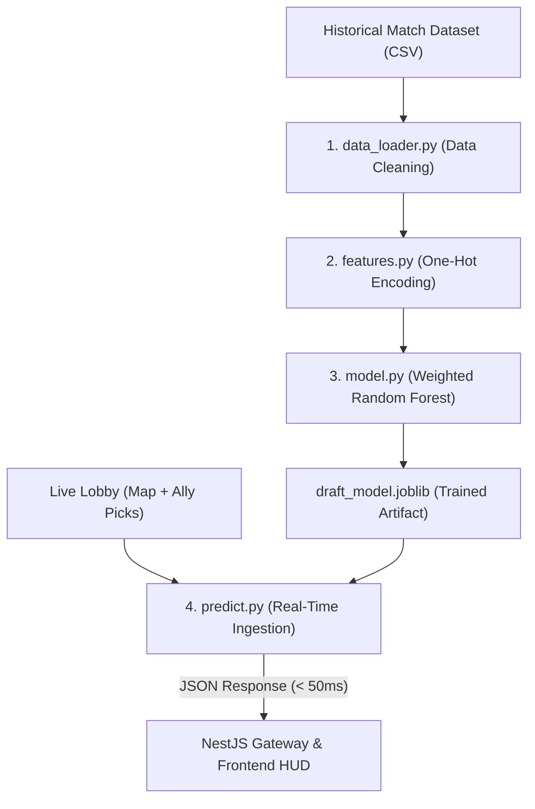

<div align="center">
  
  
  <h1 align="center">LOADOUT AI // TACTICAL RADAR & DRAFT ML</h1>
  <p align="center"><strong>VALORANT Real-Time Drafting Assistant & Round Economy Engine</strong></p>
  
  <p align="center">
    <a href="#"></a>
    <a href="#"></a>
    <a href="#"></a>
    <a href="#"></a>
    <a href="#"></a>
    <a href="#"></a>
    <a href="#"></a>
    <a href="#"></a>
  </p>
</div>

---

## Table of Contents
- [What is Loadout AI?](#what-is-loadout-ai)
- [Key Features](#key-features)
- [Machine Learning Draft Engine](#machine-learning-draft-engine)
- [Architecture & Tech Stack](#architecture--tech-stack)
- [Project Structure](#project-structure)
- [Getting Started](#getting-started)
  - [1. Prerequisites](#1-prerequisites)
  - [2. Node.js Setup](#2-nodejs-setup)
  - [3. Python Environment Setup](#3-python-environment-setup)
  - [4. Model Training](#4-model-training)
  - [5. Running the Application](#5-running-the-application)
- [Desktop Overlay (Electron)](#desktop-overlay-electron)
- [Internationalization (i18n)](#internationalization-i18n)

---

## What is Loadout AI?

**Loadout AI** is a tactical assistant and real-time draft recommendation system for **VALORANT**. Inspired by high-ELO professional coaching tools, it operates alongside your local game client without requiring manual input or alt-tabbing.

By combining **Riot Client local APIs**, **WebSockets**, a **NestJS backend**, a responsive **Next.js frontend**, and a **Scikit-Learn Machine Learning pipeline**, Loadout AI predicts team synergy win rates and recommends optimal agent picks in milliseconds.

<div align="center">
  
  <br>
  <i>"Predict the draft. Master the economy. Win the match."</i>
</div>

---

## Key Features

### Real-Time Local Game Radar
- Hooks into your local Riot Client via `lockfile` authentication and WebSocket streams.
- Instantly detects game phases: **Menus (`MENUS`)**, **Agent Select / Draft (`PREGAME`)**, and **In-Game (`INGAME`)**.
- Zero manual input: updates automatically the moment you or your teammates select or lock an agent.

### Real-Time AI Draft & Synergy Coach
- Analyzes team composition against historical competitive match data for the active map.
- Calculates your team's current **Synergy Win Rate (%)** in real time.
- Ranks candidate agents by their marginal win rate contribution, highlighting top-tier picks dynamically in the HUD.

### 1:1 In-Game Buy Menu HUD
- Pixel-perfect replication of VALORANT's in-game Buy Menu.
- Dynamic credits counter, shield selection, sidearms, and primary weapon stats.
- Auto-scaling layout designed for tactical second-screen setups or desktop overlays.

### Dual Language Support (i18n)
- Native support for **English** and **Spanish** with instantaneous runtime language switching.

### Desktop Overlay & Web Modes
- Launch directly as an **Electron Desktop App** or as a browser-based dashboard on `http://localhost:3000`.

---

## Machine Learning Draft Engine

The AI engine lives in [`src/machine_learning/`](file:///c:/Users/chumi/OneDrive/Escritorio/valorant-ai/src/machine_learning) and is built with Python and Scikit-Learn:



### Module Breakdown:
1. **[data_loader.py](file:///c:/Users/chumi/OneDrive/Escritorio/valorant-ai/src/machine_learning/data_loader.py)**: Loads CSV data, unpacks 5-agent composition arrays, validates complete teams, and normalizes agent and map entities.
2. **[features.py](file:///c:/Users/chumi/OneDrive/Escritorio/valorant-ai/src/machine_learning/features.py)**: Converts categorical map and agent names into numeric feature matrices using **One-Hot Encoding** (`map_*` and `agent_*` columns). Also provides `encode_single_composition()` for single-row live inference.
3. **[model.py](file:///c:/Users/chumi/OneDrive/Escritorio/valorant-ai/src/machine_learning/model.py)**: Configures and trains a `RandomForestRegressor` with sample frequency weights (`sample_weight=times_played`), evaluates performance ($R^2$ Score and RMSE), and manages `.joblib` serialization.
4. **[train_draft_model.py](file:///c:/Users/chumi/OneDrive/Escritorio/valorant-ai/src/machine_learning/train_draft_model.py)**: Executable pipeline script that loads raw statistics, processes features, trains the model, and exports the bundle.
5. **[predict.py](file:///c:/Users/chumi/OneDrive/Escritorio/valorant-ai/src/machine_learning/predict.py)**: High-speed inference CLI. Maps Riot Agent UUIDs to canonical names, evaluates all candidate combinations, and outputs structured JSON containing recommendations and synergy scores.

---

## Architecture & Tech Stack

| Layer | Technologies |
|---|---|
| **Backend Core** | NestJS (v11), TypeScript, RxJS, Axios |
| **Real-Time Communication** | Socket.IO (`@nestjs/websockets`, `@nestjs/platform-socket.io`) |
| **Frontend Framework** | Next.js (v16), React 19, Vanilla CSS Modules & Tokens |
| **Desktop Wrapper** | Electron (v43) |
| **Machine Learning** | Python 3.10+, Scikit-Learn, Pandas, NumPy, Joblib |
| **Data Sources** | Riot Local Client API (Lockfile / WSS), Valorant-API.com |

---

## Project Structure

```bash
valorant-ai/
├── electron/                   # Electron desktop application entry points
│   ├── main.js                 # BrowserWindow lifecycle and window management
│   └── preload.js              # Secure IPC preload script
├── frontend/                   # Next.js 16 + React 19 Client
│   ├── src/
│   │   ├── app/                # Next.js App Router & global styles
│   │   ├── components/         # HUD panels, Views (Pregame, Ingame, Menus)
│   │   ├── context/            # Language & localization context
│   │   ├── hooks/              # useGameState (Socket.IO), useValorantData
│   │   └── csv/                # Raw historical match datasets
├── src/                        # NestJS Backend Application
│   ├── gateway/                # WebSocket Gateway & Riot Local API Service
│   ├── machine_learning/       # Python Machine Learning Pipeline
│   │   ├── economy/            # Economy & buy recommendation ML models
│   │   ├── pregame/            # Agent pick & draft win rate models
│   │   └── shared/             # Shared constants, feature mappings & schemas
│   └── main.ts                 # NestJS Application Bootstrap
├── pyrightconfig.json          # Python type-checking & import resolution config
├── requirements.txt            # Python ML dependencies
└── package.json                # Project dependencies & build scripts
```

---

## Getting Started

### 1. Prerequisites
- **Node.js** (v18.x or higher) & **npm**
- **Python** (v3.10 - v3.14)
- **VALORANT Client** installed (for live radar testing)

### 2. Node.js Setup
Install backend and frontend dependencies:
```bash
# Install root (NestJS & Electron) dependencies
npm install

# Install frontend dependencies
cd frontend && npm install && cd ..
```

### 3. Python Environment Setup
Create a virtual environment in the project root and install the required ML packages:
```bash
# Create virtual environment
python -m venv .venv

# Activate virtual environment (Windows PowerShell)
.venv\Scripts\Activate.ps1

# Install ML requirements
pip install -r requirements.txt
```

### 4. Model Training
To train or re-train the Random Forest model on the latest dataset:
```bash
.venv\Scripts\python.exe -m src.machine_learning.train_draft_model
```
This generates the optimized `src/machine_learning/models/draft_model.joblib` artifact.

### 5. Running the Application

> **Note:** No `.env` file or Riot API Key is required! Loadout AI automatically and securely connects directly to your active local Riot Client / VALORANT session via the local `lockfile` protocol.

#### Development Mode (Backend + Next.js Live Reload):
```bash
# 1. Build and export the frontend
npm run build:frontend

# 2. Start the NestJS backend with auto-reload
npm run start:dev
```
Open **`http://localhost:3000`** in your browser.

---

## Desktop Overlay (Electron)

To launch Loadout AI as a standalone desktop window alongside your game:
```bash
npm run electron
```

---

## Internationalization (i18n)

Loadout AI includes bilingual support. Toggle between languages on the top navigation bar:
- **Español**
- **English**

Translations cover agent roles, synergy statuses, economy calculations, weapon categories, and draft advisories.

---

<div align="center">
  <p><i>"I am the hunter." — Sova</i></p>
  
  <br><br>
  <p>Built for the VALORANT Competitive Community</p>
</div>
